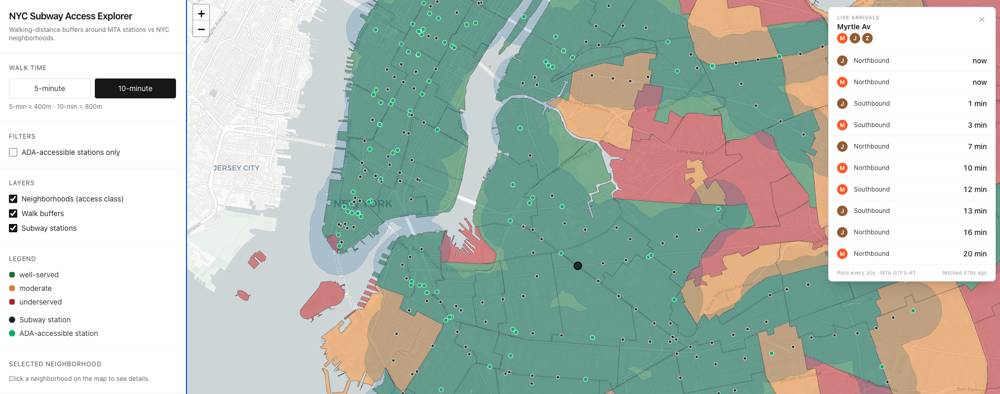

# NYC Subway Access Explorer

A local-only geospatial analytics project that analyzes NYC subway accessibility:
Python pipeline (GeoPandas / Shapely / PyProj) → GeoJSON → QGIS for inspection →
Next.js + React Leaflet web app for interactive exploration.



## What it does

For every NYC neighborhood (NTA 2020), compute the share of its area within a
**5-minute** and **10-minute** walk of any MTA subway station entrance,
classify each neighborhood as **well-served / moderate / underserved**, and
visualize the result.

Walk times are true OSM network isochrones — per-edge speed varies with the
street type (sidewalks vs. arterials vs. stairs) and a fixed crossing delay is
applied at intersection nodes. See [`web/content/walking-distance.mdx`](web/content/walking-distance.mdx)
for the full model and rationale.

Live ADA-accessible station data is included so you can also see *step-free* coverage.

## Repository layout

```
nyc-subway-access/
├── scripts/                    # Python pipeline
│   ├── fetch_data.py           # Download MTA stations + entrances + NTA polygons
│   ├── analyze.py              # Reproject, buffer, coverage, classify, export
│   └── requirements.txt
├── data/
│   ├── raw/                    # Raw downloaded GeoJSON
│   └── processed/              # Pipeline output (consumed by web app + QGIS)
├── qgis/
│   ├── nyc-subway-access.qgs   # Minimal QGIS project file
│   └── load_and_style.py       # PyQGIS script: load + style layers
├── web/                        # Next.js + TypeScript + Tailwind + React Leaflet
└── README.md
```

## 1. Run the Python pipeline

Requires Python 3.12+ (3.13/3.14 also fine).

```bash
cd nyc-subway-access
python3.12 -m venv .venv
.venv/bin/pip install -r scripts/requirements.txt

.venv/bin/python scripts/fetch_data.py     # downloads ~5 MB of raw GeoJSON
.venv/bin/python scripts/analyze.py        # writes data/processed/*.geojson
```

You should see a summary like:

```
Stations:           496
  ADA-accessible:   169
Neighborhoods:      262
  well-served    72
  moderate       64
  underserved    126

Mean 5-min coverage:  17.6%
Mean 10-min coverage: 36.8%
```

### Output files (all WGS84 / EPSG:4326)

| File | Geometry | Per-feature properties |
|---|---|---|
| `data/processed/stations.geojson` | Point | `name`, `lines`, `ada`, `gtfs_stop_id` |
| `data/processed/buffers.geojson` | Polygon (dissolved) | `walk_min` (5\|10), `ada_only`, `radius_s` |
| `data/processed/neighborhoods.geojson` | (Multi)Polygon | `name`, `borough`, `nta_code`, `coverage_5min_pct`, `coverage_10min_pct`, `coverage_ada_10min_pct`, `access_class`, `station_count` |

### Pipeline details

- Reprojects to **EPSG:32118** (NAD83 / New York Long Island, meters) for accurate
  distance / area math, then reprojects outputs back to WGS84 for web rendering.
- Walk buffers are **true network isochrones** with a time-weighted edge cost:
  each station's real-world entrances are snapped to the nearest OSM pedestrian
  node, the graph is walked outward at 5 / 10 minutes of *travel time*, and the
  reachable street edges are buffered by 25m. Per-edge speed varies by OSM
  `highway` type (sidewalks 4.8 km/h, arterials 3.6 km/h, stairs 1.8 km/h) and a
  fixed crossing delay (+30s arterials, +15s tertiary) is folded into the
  travel-time of every edge entering an intersection node. Full model in
  [`web/content/walking-distance.mdx`](web/content/walking-distance.mdx).
- The OSM walk graph is downloaded once (~5–10 min on the first `analyze.py` run)
  and cached at `data/raw/nyc_walk_network.graphml`. Subsequent runs reuse it.
  Travel-time weights are recomputed in memory each run, so the cached graphml
  stays untouched.
- Classification thresholds (% of neighborhood area within a 10-min walk):
  - `well-served`  ≥ 70%
  - `moderate`     30–70%
  - `underserved`  < 30%

### Data sources

- MTA Subway Stations: `data.ny.gov` resource `39hk-dx4f` (includes ADA flag)
- MTA Subway Entrances & Exits 2024: `data.ny.gov` resource `i9wp-a4ja`
  (joins to stations on `gtfs_stop_id`)
- NYC NTA 2020 boundaries: `data.cityofnewyork.us` resource `9nt8-h7nd`
- Pedestrian street network: OpenStreetMap (via OSMnx `network_type="walk"`)

## 2. Inspect in QGIS

Two ways:

**Option A — open the project file:**

```bash
open qgis/nyc-subway-access.qgs
```

This loads the three GeoJSON layers with QGIS default styling.

**Option B — load + style via PyQGIS (recommended):**

1. Open QGIS.
2. Plugins → Python Console (`Ctrl+Alt+P`).
3. In the console:
   ```python
   exec(open('/absolute/path/to/nyc-subway-access/qgis/load_and_style.py').read())
   ```

The script categorizes neighborhoods by `access_class`, styles the 5/10-min buffers,
and shows ADA stations differently from standard stations.

## 3. Run the web app

```bash
cd web
npm install        # only needed the first time
npm run dev
```

Open http://localhost:3305.

The web app loads GeoJSON from `web/public/data/`, which is a symlink to
`data/processed/`, so re-running the pipeline automatically updates the map on refresh.

### Features

- **Layer toggles:** stations / walk buffers / neighborhoods
- **Walk time:** switch between 5-minute and 10-minute coverage
- **ADA filter:** restrict to ADA-accessible stations + their buffers
- **Hover tooltips:** neighborhood and station details
- **Click details:** click a neighborhood to see full coverage stats in the sidebar
- **Live arrivals:** click any subway station to pin a floating overlay showing the next ~10 trains; auto-refreshes every 30s. Powered by MTA GTFS-Realtime feeds (no API key required) via the local `/api/arrivals` route.
- **Legend:** color-coded access classes

### Live arrivals API

```
GET /api/arrivals?stop_id=<gtfs_stop_id>
```

Server-side route in `web/app/api/arrivals/route.ts`. It fetches all 8 NYCT GTFS-Realtime feeds in parallel (cached for 15s), decodes the protobuf via `gtfs-realtime-bindings`, and returns the next arrivals at the parent stop_id. Direction (N/S) comes from the suffix on the feed's stop_id.

## Tech stack

| Layer | Tools |
|---|---|
| Pipeline | Python 3.12, GeoPandas, Shapely, PyProj, pandas, certifi, OSMnx, NetworkX |
| Desktop GIS | QGIS 3.x (PyQGIS for styling) |
| Web | Next.js 16 (App Router), TypeScript, Tailwind v4, React Leaflet 5, Leaflet, `gtfs-realtime-bindings` |
| Basemap | CARTO Light (OpenStreetMap data) |

## Future enhancements

- **GTFS *schedule* analysis (service frequency, headway stats)** — Today the model treats every station equally. A stop with trains every 4 minutes provides very different access from one served every 20 minutes; weighting coverage by service frequency would reflect actual usability, not just proximity.
- **Bus coverage** — Many neighborhoods classified as "underserved" by subway are well-connected by bus (much of southeast Brooklyn, eastern Queens, the Bronx). Adding MTA bus stops + frequencies would give a more honest picture of overall transit access.
- **Citi Bike integration** — Bike share extends the effective walk shed of every station, especially in Manhattan and inner Brooklyn. Overlaying dock locations would show where bike share meaningfully fills subway gaps.
- **Demographic overlays (ACS Census data)** — Layering income, age, or race data on the access classes turns this from a transit map into an equity tool: which underserved neighborhoods are also lower-income or have higher car-free household rates?
- **Station-level search** — With 262 neighborhoods and 496 stations, finding a specific one by panning is tedious; a search box would make the dashboard usable as a quick lookup, not just exploration.
- **WebSocket push for live arrivals** — 30-second polling is fine for casual viewing, but a push channel would surface arrivals seconds sooner and reduce repeated work on the server side for users who leave the dashboard open all day.
